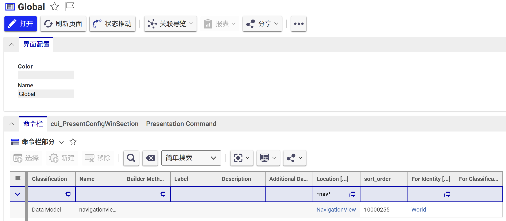
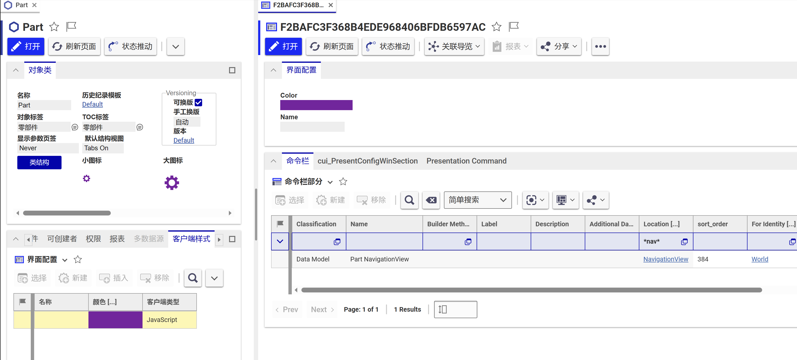
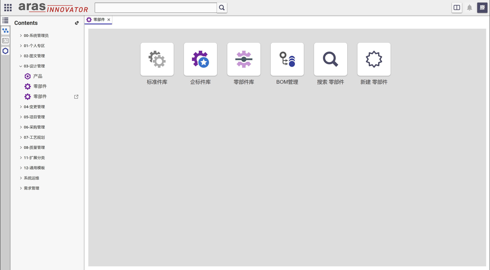

# NavigationPage

对象导航菜单页面

## 使用方式

在TOC Editor中添加导航菜单页面并根据实际需求填写对象类名称参数

- 页面地址: ../Solutions/NavigationPage/index.html
- 参数名称: itemtype

## 菜单配置

- 在全局展示设置中配置通用菜单

- 在对象类客户端样式中配置自定义菜单

## 效果展示

